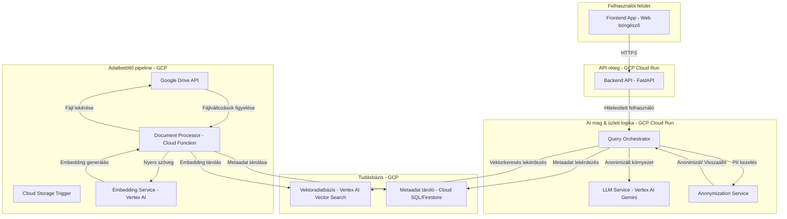
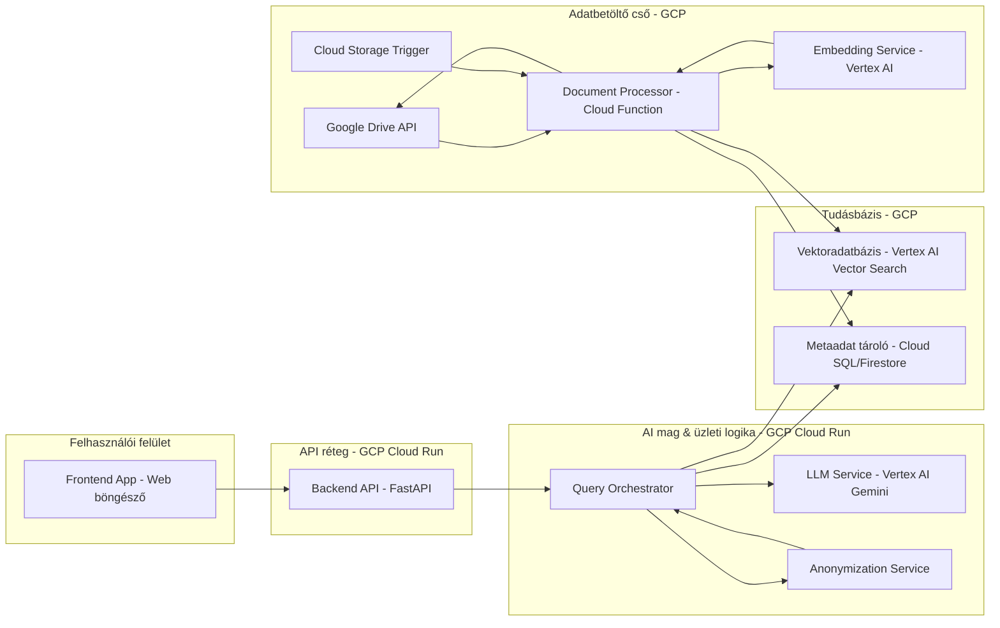
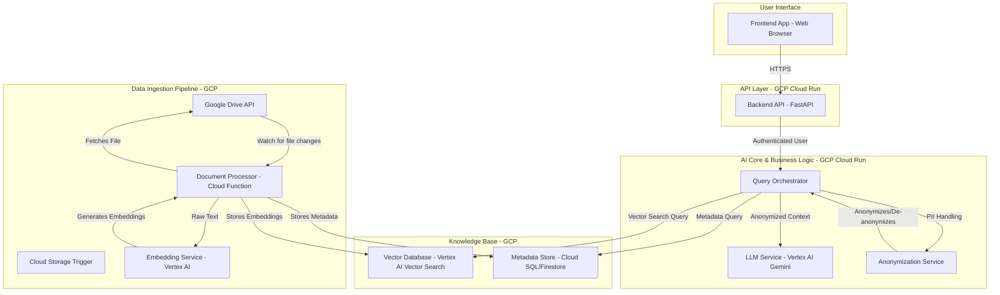
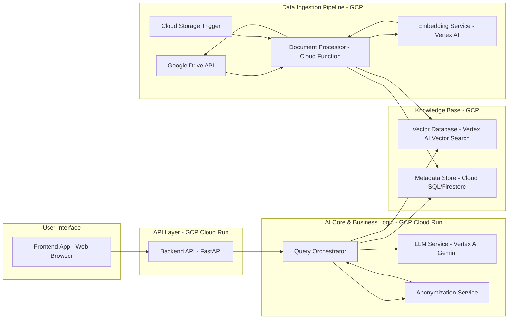

# Architektúra-terv: Resourcing AI Agent

## 1. Áttekintés

Ez a dokumentum a **Resourcing AI Agent** technikai architektúráját ismerteti. A javasolt tervezet a Termék Követelmények Dokumentumban (PRD) leírt funkcionális és nem-funkcionális követelményeken alapul, elsődleges hangsúlyt fektetve a biztonságra, skálázhatóságra és karbantarthatóságra.

A rendszer egy cloud-native alkalmazás, amely **Retrieval‑Augmented Generation (RAG)** architektúrát használ. Ez lehetővé teszi, hogy a nagyméretű nyelvi modellek (LLM-ek) erejét hasznosítsuk komplex feladatoknál, mint a szemantikus keresés és kérdés‑válasz rendszerek, miközben a válaszok tényszerű adatbázis-űrtartalmára vannak alapozva.

## 2. Architektúrai alapelvek

- **Biztonság elsőként**: Minden tervezési döntés prioritása a jelölti adatok biztonsága és magánélete. A rendszer elkülönített, védett környezetben fut, és az adatok külső szolgáltatásokkal történő megosztása szigorú kontroll alatt áll, anonimizálva.
- **Modularitás & skálázhatóság**: A rendszer különálló, laza csatolású szolgáltatásokból épül fel. Ez lehetővé teszi az egyes komponensek független skálázását, valamint az egyszerűbb karbantartást és frissítést.
- **Cloud‑Native**: Menedzselt felhőszolgáltatásokat alkalmazunk, hogy csökkentsük az operációs terheket, javítsuk a megbízhatóságot és biztosítsuk a skálázhatóságot. Elsődleges ajánlás a Google Cloud Platform (GCP), az egységes Google Workspace integráció és AI/ML lehetőségek miatt.
- **Automatizáció**: Az adatfeldolgozó és betöltő folyamat teljesen automatizált lesz, hogy a tudásbázis folyamatosan frissüljön minimális manuális beavatkozással.

## 3. Magas szintű architektúra

A rendszer négy logikai rétegre oszlik:

1. **Adatbetöltés & Feldolgozási réteg**: Biztonságos hozzáférés a Google Workspace dokumentumaihoz, szövegkinyerés, és kereshető formátumba (embedding) alakítás.
2. **Tudásbázis & tárolási réteg**: Eredeti dokumentum metaadatait és vektorképviseleteit tároló biztonságos, hatékony adattár.
3. **AI mag & Üzleti logika réteg**: Az alkalmazás agya, kezeli a felhasználói lekérdezéseket, szemantikus keresést végez és válaszokat generál.
4. **Prezentációs & API réteg**: Biztonságos API, amely a frontend felhasználói felület számára elérhetővé teszi az alapfunkciókat.

### 3.1. Rendszerarchitektúra-diagram (Mermaid)

## 4. Komponens Szintű Elemzés

### 4.1. Adatbeolvasó Pipeline

Ez az automatizált pipeline felelős azért, hogy a tudásbázis szinkronban maradjon a Google Drive-ban található mappákkal.

- **Google Drive API**: Egy GCP szolgáltatásfiókot használunk, amely csak olvasási joggal rendelkezik a megadott mappákhoz. Egy ütemezett feladat (pl. Cloud Scheduler) rendszeresen lekérdezi az új vagy frissített fájlokat.
- **Dokumentum Feldolgozó (Cloud Function)**:
  - **Letöltés**: Biztonságosan letölti a fájlt (PDF, DOCX, DOC).
  - **Szövegkinyerés**: Pl. Apache Tika segítségével kivonja a nyers szöveget.
  - **Darabolás**: A szöveget kisebb, szemantikailag jelentéssel bíró blokkokra bontja.
  - **Metaadat Tárolás**: A dokumentum metaadatait egy relációs (Cloud SQL) vagy NoSQL (Firestore) adatbázisba menti.
- **Embedding Szolgáltatás (Vertex AI)**: A szövegblokkokat embeddinggé alakítja.
- **Vektor Adatbázis**: Az embeddingek és a hozzájuk tartozó metaadatok tárolása és kereshetősége.

### 4.2. AI Mag (RAG Megvalósítás)

- **Lekérdezés Orkesztrátor**:
  - **Lekérdezés fogadása**
  - **Embedding készítése**
  - **Vektor keresés**
  - **Kontextus lekérése**
  - **Anonimizálás**: PII adatokat placeholderre cserél.
  - **Prompt összeállítása**
  - **LLM hívás**: Gemini választ generál.
  - **Visszaanonimizálás**
  - **Válasz formázása és visszaküldése**

### 4.3. API & Megjelenítés Réteg

- **Backend API (FastAPI)**: Python alapú REST API, Cloud Run konténerként telepítve.
  - **Végpontok**:
    - `POST /search`: Jelölt keresés
    - `POST /ask`: Helpdesk kérdés megválaszolása
    - `/auth/...`: OAuth 2.0 autentikáció
- **Frontend**: Egyszerű SPA, pl. React vagy Vue.js alapon. Hostolás: Firebase Hosting vagy Cloud Storage.

## 5. Hosting és Telepítési Opciók

### 5.1. Opció 1: Google Cloud Platform (Ajánlott)

- **Előnyök**:
  - Menedzselt szolgáltatások
  - Automatikus skálázás
  - Beépített biztonság
  - Google szolgáltatásokkal való natív integráció
- **Hátrányok**:
  - Költségek magasabbak lehetnek
  - Figyelni kell az adatkiáramlásra

### 5.2. Opció 2: Helyi / On-Premise Telepítés

- **Előnyök**:
  - Teljes adatkontroll
  - Nincs cloud lock-in
- **Hátrányok**:
  - Magas üzemeltetési teher
  - Hardveres skálázási nehézségek
  - Mély szakértelem szükséges
  - Lassabb hozzáférés a Google Drive-hoz

**Következtetés**: A GCP megközelítés erősen ajánlott, mivel illeszkedik a meglévő technológiai környezethez, kiemelkedő skálázhatóságot és biztonságot nyújt, valamint csökkenti a karbantartási terheket.

## 6. Biztonság és Adatvédelem

- **Hitelesítés**: Google OAuth 2.0
- **Jogosultságkezelés**: Backend validálja a szerepköröket
- **Titkosítás**: TLS (adatátvitel), GCP titkosítás (tárolt adatok)
- **Anonimizálás**: Lásd 4.2. rész – kulcselem a külső LLM-ek biztonságos használatához
- **Legkisebb jogosultság elve**: A szolgáltatásfiók csak olvasási joggal rendelkezik a Google Drive-on

# (ENG) Architecture Design: Resourcing AI Agent

## 1. Overview

This document outlines the technical architecture for the **Resourcing AI Agent**. The proposed design is based on the functional and non-functional requirements specified in the Product Requirements Document (PRD), with a primary focus on security, scalability, and maintainability.

The system is designed as a cloud-native application employing a **Retrieval-Augmented Generation (RAG)** architecture. This approach allows us to leverage the power of Large Language Models (LLMs) for complex tasks like semantic search and question-answering while grounding the responses in the factual content of our private candidate database.

## 2. Architectural Principles

- **Security First**: All design decisions prioritize the security and privacy of candidate data. The system will operate within a secure, isolated environment, and data exposure to external services will be strictly controlled and anonymized.
- **Modularity & Scalability**: The system is composed of distinct, decoupled services. This allows individual components to be scaled independently and facilitates easier maintenance and upgrades.
- **Cloud-Native**: We will leverage managed cloud services where possible to reduce operational overhead, improve reliability, and ensure scalability. The primary recommendation is Google Cloud Platform (GCP) due to its seamless integration with Google Workspace and its robust AI/ML offerings.
- **Automation**: The data ingestion and processing pipeline will be fully automated to ensure the knowledge base remains continuously up-to-date with minimal manual intervention.

## 3. High-Level Architecture

The system is divided into four main logical layers:

1. **Data Ingestion & Processing Layer**: Responsible for securely accessing documents from Google Workspace, extracting text, and transforming it into a searchable format (embeddings).
2. **Knowledge Base & Storage Layer**: A secure and efficient data store for both the original document metadata and their vector representations.
3. **AI Core & Business Logic Layer**: The brain of the application, handling user queries, performing semantic searches, and generating responses.
4. **Presentation & API Layer**: A secure API that exposes the core functionality to the frontend user interface.

### 3.1. System Architecture Diagram (Mermaid)

## 4. Component Deep Dive

### 4.1. Data Ingestion Pipeline

This automated pipeline is responsible for keeping the agent's knowledge base synchronized with the Google Drive folders.

- **Google Drive API**: We will use a GCP service account with read-only access to the specified candidate folders in Google Drive. A scheduled job (e.g., Cloud Scheduler) will periodically poll for new or updated files.
- **Document Processor (Cloud Function)**: A serverless function triggered by the detection of a new file.
  1. **Downloads**: Securely downloads the file (PDF, DOCX, DOC) from Google Drive.
  2. **Text Extraction**: Uses a library like `Apache Tika` to parse the raw text content from the document.
  3. **Chunking**: Splits the extracted text into smaller, semantically meaningful chunks (e.g., paragraphs or fixed-size overlapping blocks). This is critical for effective embedding and retrieval.
  4. **Metadata Storage**: Stores metadata about the document (filename, source folder, last modified date, etc.) in a relational database like **Cloud SQL** or a NoSQL database like **Firestore**.
- **Embedding Service (Vertex AI)**: The text chunks are sent to a text embedding model (e.g., `text-embedding-004` on Vertex AI). This model converts each text chunk into a high-dimensional vector.
- **Vector Database (Vertex AI Vector Search)**: The generated vectors (embeddings), along with a reference to their source document in the metadata store, are inserted into the vector database for efficient similarity searching.

### 4.2. AI Core (RAG Implementation)

This is the core logic that handles user requests.

- **Query Orchestrator**: This service manages the end-to-end process of responding to a user query.
  1. **Receives Request**: Gets the user's query (either a job profile or a helpdesk question) from the Backend API.
  2. **Query Embedding**: Converts the user's query into an embedding using the same model as the ingestion pipeline.
  3. **Vector Search**: Queries the **Vector Database** to find the top-N most semantically similar text chunks from the knowledge base.
  4. **Context Retrieval**: Retrieves the full text of these chunks and their associated document metadata.
  5. **Anonymization**: **This is a critical security step.** Before sending the context to the LLM, an **Anonymization Service** will scrub all Personally Identifiable Information (PII) from the retrieved text chunks, replacing names, emails, and phone numbers with generic placeholders (e.g., `[CANDIDATE_NAME]`, `[EMAIL]`). The original PII is temporarily cached for re-insertion later.
  6. **Prompt Engineering**: Constructs a detailed prompt for the LLM, combining the user's original query with the anonymized, retrieved context.
  7. **LLM Call**: Sends the prompt to the **LLM Service (Vertex AI Gemini)**. Gemini will generate the candidate summary or answer the helpdesk question based *only* on the provided context.
  8. **De-anonymization**: Re-inserts the original PII back into the LLM's response, ensuring the final answer is coherent and useful to the recruiter.
  9. **Response Formatting**: Formats the final answer and sends it back to the API layer.

### 4.3. API & Presentation Layer

- **Backend API (FastAPI on Cloud Run)**: A Python-based REST API built with FastAPI. FastAPI is chosen for its high performance, native async support (ideal for waiting on AI model responses), and automatic OpenAPI documentation. It will be deployed as a serverless container on Cloud Run for automatic scaling.
  - **Endpoints**:
    - `POST /search`: Accepts a job profile, handles authentication, and returns a ranked list of candidates with scores and summaries.
    - `POST /ask`: Accepts a helpdesk question and returns a direct answer.
    - `/auth/...`: Handles the OAuth 2.0 flow with Google Identity for user login.
- **Frontend (Simple Web App)**: A lightweight single-page application (SPA) built with a modern framework like **React or Vue.js**. It will be hosted on a static hosting service like **Firebase Hosting** or **Cloud Storage**. The focus is on simplicity and usability, not complex features.

## 5. Hosting & Deployment Options

As requested, here is a comparison of the recommended GCP approach versus a local/on-premise deployment.

### 5.1. Option 1: Google Cloud Platform (Recommended)

- **Architecture**: As described in the sections above.
- **Pros**:
  - **Managed Services**: Reduces operational burden for databases, serverless functions, and AI models.
  - **Scalability**: Services like Cloud Run and Vertex AI scale automatically.
  - **Security**: GCP offers robust, built-in security features, and keeping the entire stack within GCP simplifies compliance and data governance, especially since the source data is already in Google Workspace.
  - **Integration**: Native, high-performance integration between Google Drive, Identity, Vertex AI, and other services.
- **Cons**:
  - **Cost**: Can be more expensive than self-hosting if not managed properly, though it eliminates hardware and maintenance staff costs.
  - **Data Egress**: While processing happens within GCP, care must be taken to ensure no data leaves the designated region.

### 5.2. Option 2: Local / On-Premise Deployment

- **Architecture**: Would require replacing GCP managed services with self-hosted alternatives.
  - **Compute**: A local server running Docker or Kubernetes to host the API and processing jobs.
  - **Vector Database**: Self-hosted instances of `ChromaDB`, `Weaviate`, or `Qdrant`.
  - **LLM/Embedding Models**: Running open-source models (e.g., from Hugging Face) locally on servers with powerful GPUs.
- **Pros**:
  - **Data Control**: Data never leaves the physical premises, offering the maximum level of data isolation.
  - **No Cloud Vendor Lock-in**: Full control over the technology stack.
- **Cons**:
  - **High Operational Overhead**: Requires significant effort to set up, maintain, secure, and scale the hardware and software.
  - **Scalability Challenges**: Scaling requires purchasing and provisioning new hardware.
  - **Expertise Required**: Demands in-house expertise in DevOps, MLOps, and infrastructure security.
  - **Performance**: Accessing Google Drive data from an on-premise server will be slower and more complex than from within GCP.

**Conclusion**: The **GCP approach is strongly recommended** as it aligns perfectly with the existing technology footprint (Google Workspace), offers superior scalability and security for this use case, and significantly reduces the long-term maintenance burden.

## 6. Security & Data Privacy

- **Authentication**: All access to the application will be gated by **Google OAuth 2.0**, ensuring only authenticated KIBIT employees can use the service.
- **Authorization**: The backend API will validate user roles to ensure they have the necessary permissions.
- **Data-in-Transit**: All communication between the client, API, and backend services will be encrypted using TLS.
- **Data-at-Rest**: All data stored in Cloud SQL, Vector Search, and Cloud Storage will be encrypted by default.
- **PII Anonymization**: The PII anonymization/de-anonymization cycle described in section 4.2 is the cornerstone of our strategy to use powerful external LLMs without exposing sensitive data.
- **Principle of Least Privilege**: The service account accessing Google Drive will have **read-only** permissions and will be restricted to only the necessary folders.
