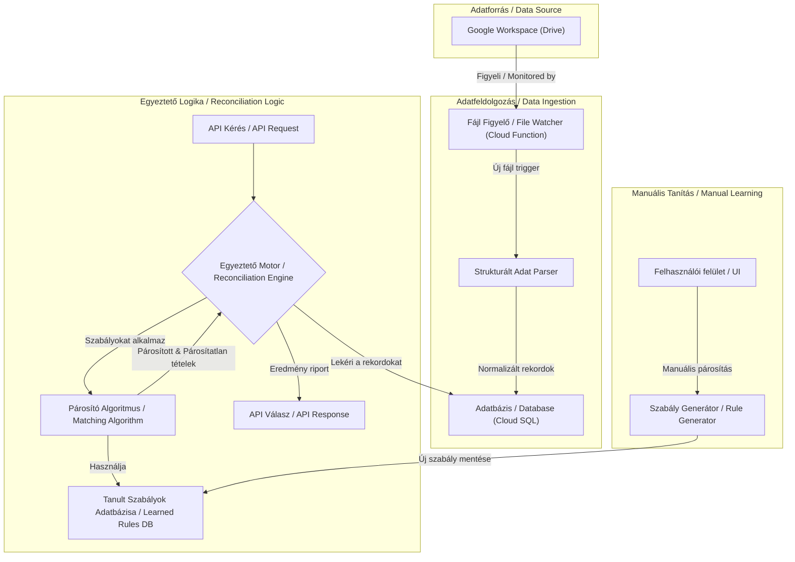

# Controlling AI Agent - Architektúra

## 1. Áttekintés

Ez a dokumentum a **Controlling AI Agent** rendszer technikai architektúráját írja le. A rendszer célja a pénzügyi egyeztetési folyamat automatizálása, intelligens párosító algoritmusok és egy öntanuló mechanizmus segítségével.

Az itt bemutatott architektúra a `docs/shared.md` dokumentumban definiált közös alapokra (pl. GCP infrastruktúra, FastAPI backend, Google OAuth) épül, és azokat egészíti ki a projekt-specifikus komponensekkel.

## 2. Architektúra Diagram

Az alábbi diagram a Controlling AI Agent rendszer főbb komponenseit és az adatáramlást szemlélteti.

## 3. Komponensek Részletesen

### 3.1. Adatbetöltő Pipeline (Data Ingestion)

A közös architektúrából örökölt, eseményvezérelt pipeline felel az adatok betöltéséért.
-   **Fájl Figyelő (Cloud Function)**: A `shared` komponens, ami figyeli a Google Drive mappában történő változásokat.
-   **Strukturált Adat Parser**: Ez a projekt-specifikus feldolgozó logika.
    -   **Technológia**: Python, `pandas`, `openpyxl`.
    -   **Feladat**: A triggerelt fájl (`.csv`, `.xlsx`, Google Sheet) beolvasása. A különböző oszlopsémákat egy egységes, normalizált formátumra hozza (pl. `tranzakcio_datum`, `osszeg`, `leiras`, `forras_tipus`).
    -   **Kimenet**: A normalizált rekordokat beírja az adatbázis (Cloud SQL) egy átmeneti `transactions` táblájába.

### 3.2. Egyeztető Motor (Reconciliation Engine)

Ez az alkalmazás központi vezérlő komponense, amely egy API hívásra aktiválódik.
-   **Technológia**: Python, FastAPI.
-   **Folyamat**:
    1.  Fogadja a kérést egy adott időszakra vonatkozó egyeztetésre.
    2.  Lekérdezi az adatbázisból az adott időszakhoz tartozó normalizált banki és belső tranzakciókat.
    3.  Meghívja a `Párosító Algoritmus`-t a két adathalmazzal.
    4.  A kapott eredményeket (párosított, nem párosított banki, nem párosított belső) strukturálja és visszaadja az API válaszában.

### 3.3. Párosító Algoritmus (Matching Algorithm)

A rendszer "agya", amely a tényleges párosítást végzi egy előre definiált szabályhierarchia szerint.
-   **Technológia**: Python.
-   **Szabályhierarchia**:
    1.  **Tanult Szabályok Alkalmazása**: Elsőként a felhasználók által manuálisan létrehozott, specifikus szabályokat próbálja alkalmazni. (Pl. "HA a leírás 'XY Kft' ÉS az összeg ~50 000 Ft, AKKOR párosítsd az INV-123 számlával").
    2.  **Szigorú Szabályok (Strict Rules)**: Ha a tanult szabály nem hoz eredményt, akkor egzakt egyezéseket keres: `összeg` + `dátum` + `egyedi hivatkozási azonosító`.
    3.  **Laza Szabályok (Fuzzy Rules)**: Ha még mindig nincs találat, rugalmasabb egyezést keres:
        -   Összeg egy szűk toleranciasávon (pl. ±0.5%) belül van.
        -   Dátum egy szűk időablakon (pl. ±3 nap) belül van.
        -   A leírás szövege nagyfokú hasonlóságot mutat (pl. `fuzzywuzzy` könyvtárral mérve).

### 3.4. Tanuló Komponens (Learning Component)

Ez a modul teszi lehetővé, hogy a rendszer idővel egyre pontosabbá váljon.
-   **Trigger**: A felhasználó a UI-n manuálisan párosít két tételt.
-   **Szabály Generátor**:
    -   Egy API végpont fogadja a két manuálisan párosított tétel azonosítóját.
    -   A generátor elemzi a két tétel tulajdonságait (pl. a leírásban szereplő egyedi szavak, a dátumok eltérése).
    -   Ebből egy új, nagyon specifikus, de hatékony párosítási szabályt hoz létre.
    -   Az új szabályt elmenti a `learned_rules` adatbázis-táblába, így az a következő futáskor már a hierarchia tetején alkalmazásra kerül.

### 3.5. API Végpontok

A `shared` FastAPI alkalmazáson belül a következő specifikus végpontok szükségesek:
-   `POST /controlling/reconcile`: Új egyeztetési folyamat indítása egy adott időszakra.
-   `GET /controlling/reconcile/{job_id}`: Egy futó folyamat állapotának és eredményeinek lekérdezése.
-   `POST /controlling/manual-match`: Két tétel manuális párosítása, ami a Tanuló Komponenst triggereli.

## 4. Adatmodell (Cloud SQL)

A rendszer az alábbi főbb táblákra épül:

-   `transactions`: A normalizált banki és belső tranzakciók tárolására.
    -   `id`, `source_file`, `transaction_date`, `amount`, `description`, `type` ('bank' vagy 'internal').
-   `reconciliation_jobs`: Az egyeztetési futamok követésére.
    -   `id`, `status` ('pending', 'running', 'completed'), `created_at`.
-   `matched_pairs`: A párosított tételek tárolására.
    -   `id`, `job_id`, `bank_transaction_id`, `internal_transaction_id`, `match_type` ('strict', 'fuzzy', 'learned', 'manual').
-   `learned_rules`: A manuálisan generált szabályok tárolására.
    -   `id`, `rule_definition` (JSON formátumban), `created_by`.

## 5. Technológiai Stack

-   **Backend**: Python 3.11+, FastAPI, Pandas, SQLAlchemy, FuzzyWuzzy
-   **Adatbázis**: Google Cloud SQL (PostgreSQL)
-   **Infrastruktúra**: Google Cloud Run, Google Cloud Functions
-   **Frontend**: React (vagy Vue.js)
-   **Hitelesítés**: Google OAuth 2.0 (a `shared` komponensből) 