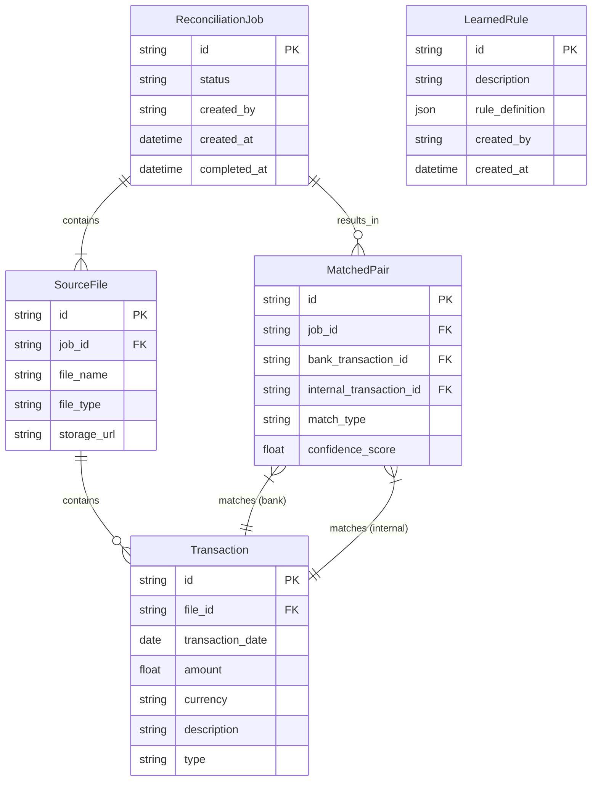

# Adatmodellek és Sémák - Controlling AI Agent

## 1. Miért fontos az adatmodell?
A Controlling AI Agent esetében az adatmodell a pénzügyi egyeztetés pontosságának, auditálhatóságának és hatékonyságának alapja. Egy jól megtervezett séma biztosítja, hogy a banki tranzakciókat és a belső nyilvántartásokat megbízhatóan tudjuk tárolni, párosítani, és a "tanult" szabályokat hatékonyan tudjuk alkalmazni. Az adatmodell garantálja az adatok integritását és a folyamat nyomon követhetőségét.

---

## 2. Fő technológiák, frameworkök és könyvtárak

### Backend (API & Business Logic)
- **Python 3.11+**: Modern, gyors fejlesztés, ideális adatfeldolgozási feladatokhoz.
- **FastAPI**: Nagy teljesítményű, aszinkron REST API, automatikus OpenAPI dokumentációval.
- **SQLAlchemy**: ORM a relációs adatbázis (Cloud SQL) kezeléséhez, ami elengedhetetlen a tranzakciós adatok konzisztenciájához.
- **Pydantic**: Szigorú adatvalidáció és séma-definíciók a FastAPI-hoz.
- **Pandas**: Alapvető könyvtár a `.csv` és `.xlsx` fájlok beolvasásához, tisztításához és normalizálásához.
- **FuzzyWuzzy**: Könyvtár a szöveges adatok "laza" (fuzzy) összehasonlításához, pl. elgépelt partnernevek egyeztetésére.

### Adattárolás
- **Cloud SQL (PostgreSQL)**: Robusztus, menedzselt relációs adatbázis a tranzakciók, párosítások és a tanult szabályok tárolására. Az SQL tranzakciós képességei garantálják az adatok konzisztenciáját.
- **Google Cloud Storage**: A feltöltött eredeti input fájlok (kivonatok, számlalisták) biztonságos, archivált tárolására.

### Frontend
- **React** vagy **Vue.js**: Modern SPA keretrendszer az interaktív felhasználói felület megvalósításához.
- **Firebase Hosting**: Biztonságos, skálázható statikus web hosting.

---

## 3. Entitás-kapcsolat diagram (ERD)



---

## 4. Táblák, mezők, indexek

### `reconciliation_jobs`
- **id**: Egyedi azonosító (UUID).
- **status**: Az egyeztetési futás állapota ('pending', 'running', 'completed', 'failed').
- **created_by**: A futást indító felhasználó email címe.
- **created_at**: A futás indításának időbélyege.
- **completed_at**: A futás befejezésének időbélyege.
- **Indexek**: `status`, `created_by`.

### `source_files`
- **id**: Egyedi azonosító (UUID).
- **job_id**: Hivatkozás a `reconciliation_jobs` táblára.
- **file_name**: Az eredeti fájlnév.
- **file_type**: 'bank_statement' vagy 'internal_ledger'.
- **storage_url**: A fájl helye a Google Cloud Storage-ben.
- **Indexek**: `job_id`.

### `transactions`
- **id**: Egyedi azonosító (UUID).
- **file_id**: Hivatkozás a `source_files` táblára.
- **transaction_date**: A tranzakció dátuma.
- **amount**: Az összeg.
- **currency**: Pénznem (pl. 'HUF', 'EUR').
- **description**: A tranzakció leírása, közleménye.
- **type**: A `source_files` táblából örökölt típus ('bank_statement' vagy 'internal_ledger').
- **Indexek**: `file_id`, `transaction_date`, `amount`.

### `matched_pairs`
- **id**: Egyedi azonosító (UUID).
- **job_id**: Hivatkozás a `reconciliation_jobs` táblára.
- **bank_transaction_id**: Hivatkozás a banki tranzakcióra a `transactions` táblában.
- **internal_transaction_id**: Hivatkozás a belső tranzakcióra a `transactions` táblában.
- **match_type**: A párosítás módja ('strict', 'fuzzy', 'learned', 'manual').
- **confidence_score**: A gépi párosítás megbízhatósági pontszáma (0.0 - 1.0).
- **Indexek**: `job_id`, `bank_transaction_id`, `internal_transaction_id`.

### `learned_rules`
- **id**: Egyedi azonosító (UUID).
- **description**: A szabály ember által olvasható leírása (pl. "Partner X Kft. ~50ezer Ft-os tételei").
- **rule_definition**: A szabály logikája gép által feldolgozható formában (JSON).
- **created_by**: A szabályt létrehozó felhasználó (a manuális párosításkor).
- **created_at**: A szabály létrehozásának időbélyege.
- **Indexek**: `created_by`.

---

## 5. Példa adatstruktúrák

**Példa `transaction` rekord:**
```json
{
  "id": "txn_1a2b3c",
  "file_id": "file_xyz",
  "transaction_date": "2025-06-15",
  "amount": 50500.00,
  "currency": "HUF",
  "description": "Közlemény: Számla kifizetése - INV-2025-077",
  "type": "bank_statement"
}
```

**Példa `learned_rules` rekord:**
```json
{
  "id": "rule_def_1",
  "description": "Partner X Kft. számlái az OTP-s jóváírásokhoz",
  "rule_definition": {
    "bank_conditions": {
      "description_contains": "Partner X Kft"
    },
    "internal_conditions": {
      "description_contains": "INV-"
    },
    "match_logic": {
      "amount_tolerance_percent": 0.5,
      "date_tolerance_days": 3
    }
  },
  "created_by": "laszlo@kibit.hu",
  "created_at": "2025-06-18T10:00:00Z"
}
```

---

## 6. Technológiák szerepe összefoglalva

- **FastAPI & Pydantic**: Biztosítja, hogy a bejövő adatok (pl. API hívások) megfeleljenek a várt sémának, megelőzve az adatbázisba kerülő hibás adatokat.
- **SQLAlchemy**: Lehetővé teszi a komplex adatbázis-műveletek (pl. tranzakciók, join-ok) biztonságos és Python-szerű kezelését.
- **Pandas**: A strukturált adatok normalizálásának és előfeldolgozásának motorja.
- **Cloud SQL**: A pénzügyi adatok perzisztens, biztonságos és konzisztens tárolója, amely lehetővé teszi a komplex lekérdezéseket és az auditálhatóságot.
- **FuzzyWuzzy**: A párosító algoritmus kulcsfontosságú eleme, amely segít az elgépelt vagy kissé eltérő szöveges adatok párosításában. 