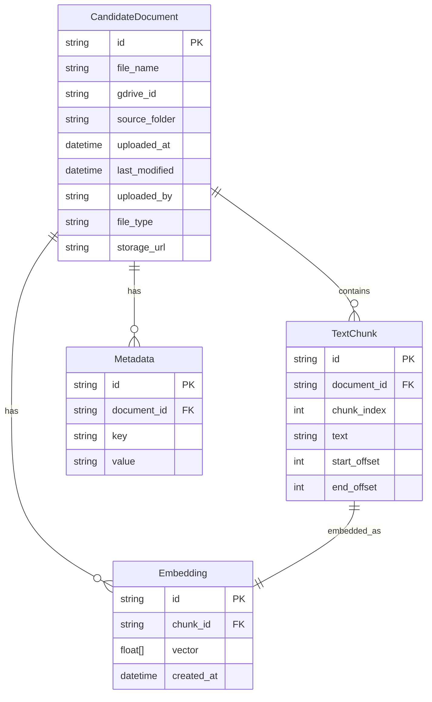

# Data Models & Schematics

## 1. Miért fontos az adatmodell?
Az adatmodell meghatározza, hogyan tároljuk, indexeljük és érjük el a jelöltek dokumentumait, metaadatait és a hozzájuk tartozó vektorokat. A jól megtervezett adatmodell biztosítja a gyors keresést, a skálázhatóságot, a biztonságot és a megfelelést az adatvédelmi előírásoknak.

---

## 2. Fő technológiák, frameworkök és könyvtárak

### Backend (API & Business Logic)
- **Python 3.10+**: Modern, gyors fejlesztés, széles AI/ML ökoszisztéma.
- **FastAPI**: Nagy teljesítményű, aszinkron REST API, automatikus OpenAPI dokumentációval.
- **SQLAlchemy**: ORM a relációs adatbázis kezeléséhez (Cloud SQL).
- **Pydantic**: Adatvalidáció és séma-definíciók a FastAPI-hoz.
- **Google Cloud Libraries**: pl. `google-cloud-storage`, `google-cloud-sql`, `google-cloud-firestore`, `google-cloud-aiplatform` – natív integráció GCP szolgáltatásokhoz.
- **Authlib**: OAuth 2.0 hitelesítés Google Identity-vel.

### Adatfeldolgozás & Embedding pipeline
- **Apache Tika** (vagy `textract`): Dokumentum szövegkinyerés PDF/DOCX/DOC formátumokból.
- **Vertex AI Embedding API**: Szöveg embedding generálás (pl. `text-embedding-004`).
- **Google Cloud Functions**: Serverless feldolgozás, triggerelhető új dokumentumoknál.

### Adattárolás
- **Cloud SQL (PostgreSQL)**: Relációs metaadat-tárolás, tranzakciók, indexek, lekérdezések.
- **Firestore**: Alternatív NoSQL metaadat-tárolás, ha rugalmasabb séma kell.
- **Vertex AI Vector Search**: Vektor-adatbázis, gyors hasonlóság-alapú kereséshez.
- **Google Cloud Storage**: Dokumentumok (pl. PDF) biztonságos tárolása.

### Frontend
- **React** vagy **Vue.js**: Modern SPA, gyors fejlesztés, jó GCP integráció.
- **Firebase Hosting**: Biztonságos, skálázható statikus web hosting.

---

## 3. Entitás-kapcsolat diagram (ERD)



---

## 4. Táblák, mezők, indexek

### CandidateDocument (Cloud SQL / Firestore)
- **id**: Egyedi azonosító (UUID)
- **file_name**: Fájlnév
- **gdrive_id**: Google Drive fájl-azonosító
- **source_folder**: Forrásmappa
- **uploaded_at**: Feltöltés ideje
- **last_modified**: Utolsó módosítás
- **uploaded_by**: Feltöltő felhasználó
- **file_type**: pdf, docx, doc
- **storage_url**: Cloud Storage elérési út
- **Indexek**: gdrive_id, source_folder, last_modified

### TextChunk (Cloud SQL / Firestore)
- **id**: Egyedi azonosító
- **document_id**: Hivatkozás a CandidateDocument-re
- **chunk_index**: Sorrendi index
- **text**: Szövegrészlet
- **start_offset**, **end_offset**: Pozíció az eredeti dokumentumban
- **Indexek**: document_id, chunk_index

### Embedding (Vertex AI Vector Search)
- **id**: Egyedi azonosító
- **chunk_id**: Hivatkozás a TextChunk-ra
- **vector**: Float vektor (pl. 768 dimenzió)
- **created_at**: Létrehozás ideje
- **Indexek**: chunk_id, vektor index (automatikus)

### Metadata (Cloud SQL / Firestore)
- **id**: Egyedi azonosító
- **document_id**: Hivatkozás a CandidateDocument-re
- **key**: Metaadat kulcs (pl. "language", "source")
- **value**: Metaadat érték
- **Indexek**: document_id, key

---

## 5. Példa metaadat-struktúrák

```json
{
  "id": "doc_123",
  "file_name": "John_Doe_CV.pdf",
  "gdrive_id": "1a2b3c4d",
  "source_folder": "2025/JavaDevs",
  "uploaded_at": "2025-06-18T10:00:00Z",
  "last_modified": "2025-06-18T10:00:00Z",
  "uploaded_by": "anna@kibit.hu",
  "file_type": "pdf",
  "storage_url": "gs://bucket/cv/John_Doe_CV.pdf"
}
```

```json
{
  "id": "chunk_001",
  "document_id": "doc_123",
  "chunk_index": 0,
  "text": "Senior Java developer with 10+ years experience...",
  "start_offset": 0,
  "end_offset": 256
}
```

---

## 6. Vektor-adatbázis séma (Vertex AI Vector Search)
- **Index**: Automatikusan kezelt, vektor-alapú keresés.
- **Dokumentum**: Minden rekord egy embedding, metaadatokkal (pl. chunk_id, document_id, releváns mezők).
- **Keresés**: Hasonlóság-alapú (cosine similarity, dot product).
- **Metaadat**: Lekérdezéskor szűrhető (pl. csak adott mappából, időszakból).

---

## 7. Technológiák szerepe összefoglalva

- **FastAPI**: REST API, gyors válaszidő, async támogatás, OpenAPI dokumentáció.
- **SQLAlchemy**: ORM, relációs adatbázis séma és lekérdezések Pythonból.
- **Pydantic**: Adatmodellek, validáció, automatikus dokumentáció.
- **Google Cloud Storage**: Dokumentumok biztonságos tárolása, hozzáférés kontroll.
- **Cloud SQL / Firestore**: Metaadatok, tranzakciók, gyors lekérdezés, indexelés.
- **Vertex AI Vector Search**: Nagy teljesítményű, skálázható vektor-alapú keresés.
- **Apache Tika / textract**: Dokumentum szövegkinyerés, több formátum támogatása.
- **Vertex AI Embedding**: SOTA embedding modellek, GCP integráció.
- **React / Vue.js**: Modern, reszponzív frontend, gyors fejlesztés.
- **Firebase Hosting**: Biztonságos, skálázható web hosting.
- **Authlib**: OAuth 2.0, Google SSO integráció.

---
