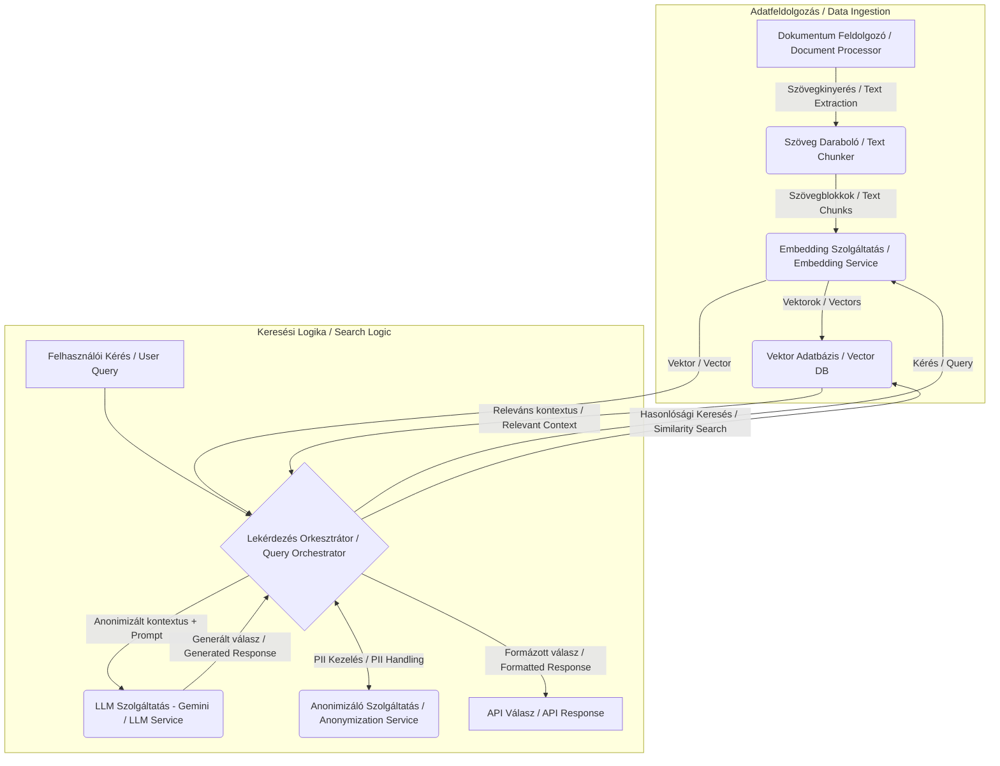
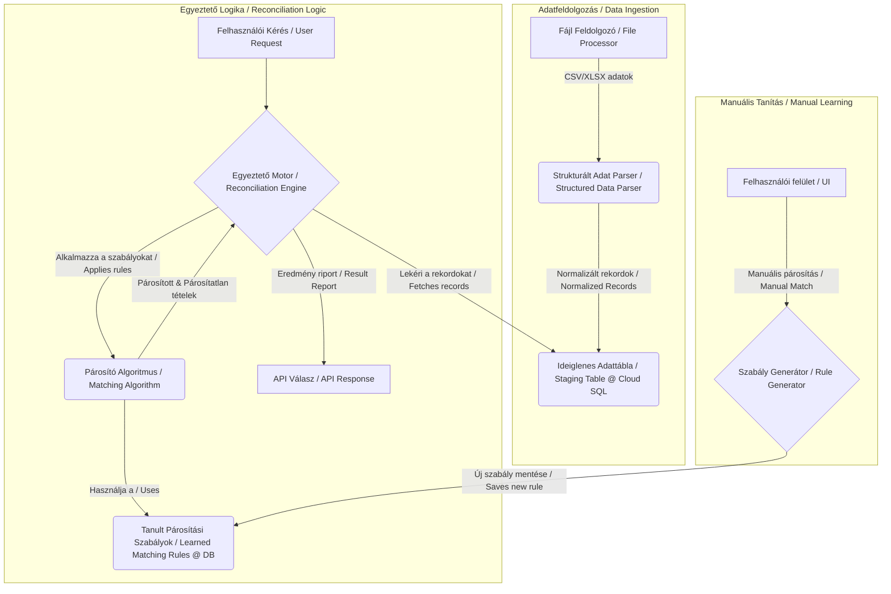

# Projekt-specifikus komponensek / Project-Specific Components

## 1. Bevezetés / Introduction

Ez a dokumentum a `docs/shared.md`-ben leírt közös architektúra kiegészítése. Célja, hogy részletezze azokat a komponenseket, adatfeldolgozási lépéseket és technológiákat, amelyek kifejezetten csak a **Resourcing AI Agent** vagy a **Controlling AI Agent** projekthez tartoznak. Ezek az elemek valósítják meg az egyes alkalmazások egyedi üzleti logikáját.

This document complements the common architecture described in `docs/shared.md`. Its purpose is to detail the components, data processing steps, and technologies that are specific to either the **Resourcing AI Agent** or the **Controlling AI Agent** project. These elements implement the unique business logic of each application.

---

## 2. Resourcing AI Agent – Specifikus Komponensek

A Resourcing AI Agent célja a jelölti adatbázisban (önéletrajzok, jegyzetek) való szemantikus keresés és a jelöltek értékelése egy adott pozícióra. Ez alapvetően egy **Retrieval-Augmented Generation (RAG)** rendszer.

The purpose of the Resourcing AI Agent is to perform semantic searches within the candidate database (resumes, notes) and to evaluate candidates for a specific position. This is fundamentally a **Retrieval-Augmented Generation (RAG)** system.

### 2.1. Specifikus Architektúra Diagram / Specific Architecture Diagram

### 2.2. Egyedi Komponensek és Folyamatok / Unique Components and Processes

-   **Szövegkinyerés és -feldolgozás (Text Extraction and Processing)**:
    -   **Technológia**: `Apache Tika` vagy hasonló könyvtárak.
    -   **Folyamat**: A pipeline-nak képesnek kell lennie a strukturálatlan `.pdf`, `.docx`, `.doc` fájlokból a nyers szöveg kinyerésére, majd a szöveget szemantikailag releváns, kisebb egységekre (chunk) kell bontania. Ez a RAG folyamat kritikus lépése.

-   **Embedding Szolgáltatás (Embedding Service)**:
    -   **Technológia**: `Vertex AI Text Embedding Model`.
    -   **Folyamat**: A szövegdarabokat nagy dimenziós vektorként (embedding) reprezentálja, ami a szemantikai jelentést hordozza. A felhasználói kérések is ugyanezen a modellen keresztül alakulnak vektorrá.

-   **Vektor Adatbázis (Vector Database)**:
    -   **Technológia**: `Vertex AI Vector Search` (korábban Matching Engine), `ChromaDB` vagy `Pinecone`.
    -   **Szerep**: Az embeddingek tárolása és a rendkívül gyors, nagy skálájú hasonlósági keresés lehetővé tétele. Ez a komponens a `Controlling AI Agent` számára felesleges.

-   **LLM (Large Language Model) Integráció**:
    -   **Technológia**: `Vertex AI Gemini`.
    -   **Szerep**: A vektoros keresés által visszaadott releváns szövegdarabok (kontextus) és a felhasználói kérés alapján koherens, emberi nyelven megfogalmazott összefoglalót és értékelést generál.

-   **Személyes Adatok Anonimizálása (PII Anonymization)**:
    -   **Szerep**: Mielőtt a kontextus a külső LLM szolgáltatáshoz kerül, egy dedikált szolgáltatás eltávolítja a személyes adatokat (név, email, telefon), és egyedi placeholder-ekkel helyettesíti azokat. A válasz megérkezése után a placeholder-eket visszaállítja az eredeti adatokra. Ez a lépés garantálja az adatvédelmi előírások betartását.

---

## 3. Controlling AI Agent – Specifikus Komponensek

A Controlling AI Agent célja a strukturált adatok (banki kivonatok, számlalisták) intelligens párosítása és az eltérések kimutatása. Ez alapvetően egy **Adat-egyeztető (Reconciliation)** rendszer.

The purpose of the Controlling AI Agent is the intelligent matching of structured data (bank statements, invoice lists) and the identification of discrepancies. This is fundamentally a **Data Reconciliation** system.

### 3.1. Specifikus Architektúra Diagram / Specific Architecture Diagram

### 3.2. Egyedi Komponensek és Folyamatok / Unique Components and Processes

-   **Strukturált Adatfeldolgozás (Structured Data Processing)**:
    -   **Technológia**: `pandas`, `openpyxl`.
    -   **Folyamat**: A pipeline-nak képesnek kell lennie a `.csv`, `.xlsx`, és Google Sheets formátumokból származó táblázatos adatok beolvasására. A különböző forrásokból származó adatokat egy közös, normalizált sémára kell hozni.

-   **Egyeztető Motor (Reconciliation Engine)**:
    -   **Szerep**: Ez az alkalmazás magja. Levezényli a két (vagy több) adatforrásból származó rekordok beolvasását és összehasonlítását.
    -   **Logika**: Kezeli az egy-az-egyhez, egy-a-többhöz, és több-a-többhöz típusú párosítási forgatókönyveket.

-   **Párosító Algoritmus (Matching Algorithm)**:
    -   **Logika**: Ez a komponens tartalmazza a konkrét párosítási szabályokat.
        -   **Szigorú szabályok**: Pl. összeg, dátum, számlaszám pontos egyezése.
        -   **Laza szabályok (Fuzzy Logic)**: Pl. névelírások kezelése (fuzzy string matching), dátumintervallumok használata, összegbeli kis eltérések tolerálása.

-   **Tanuló Komponens (Learning Component)**:
    -   **Szerep**: Lehetővé teszi, hogy a felhasználó a felületen manuálisan párosítson olyan tételeket, amiket az algoritmus nem ismert fel.
    -   **Folyamat**: Amikor egy manuális párosítás megtörténik, a rendszer elemzi a párosított tételek jellemzőit (pl. egyedi szövegrészlet a közleményben), és egy új, specifikus szabályt hoz létre belőle. Ezt a szabályt a jövőbeli automatikus futások során már alkalmazni tudja, így a rendszer "tanul" és egyre pontosabbá válik. Az ehhez szükséges szabályokat a megosztott adatbázisban (pl. Cloud SQL) lehet tárolni. 