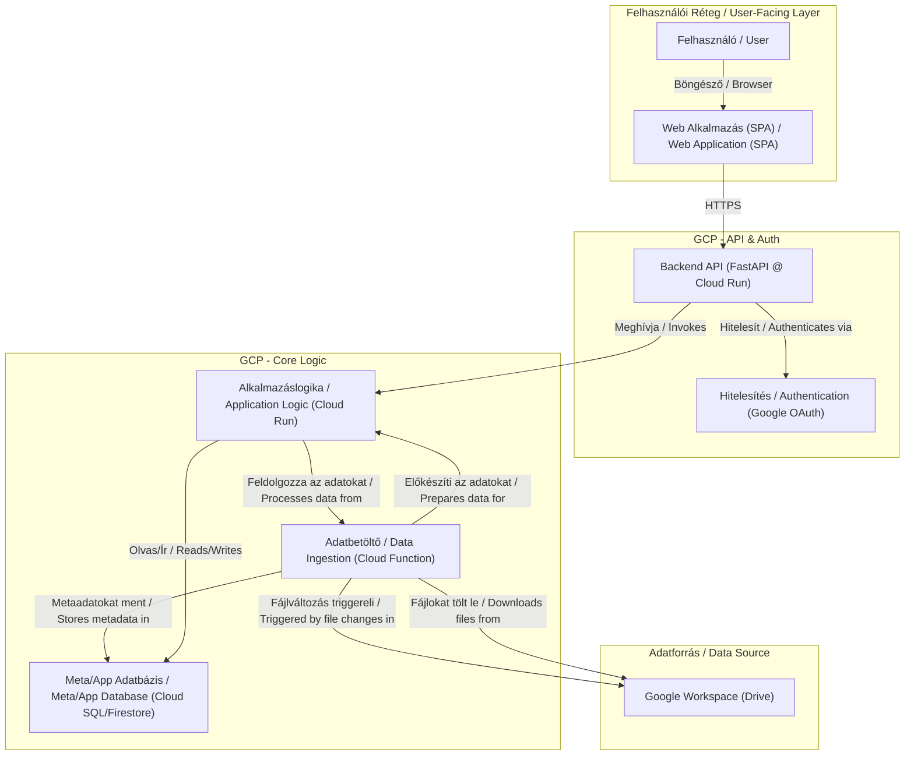

# Közös architekturális elemek és komponensek / Shared Architectural Elements and Components

## 1. Bevezetés / Introduction

Ez a dokumentum a **Resourcing AI Agent** és a **Controlling AI Agent** projektek közös technikai alapjait és újrafelhasználható komponenseit írja le. A cél egy olyan absztrakt, robusztus és skálázható architektúra létrehozása, amely mindkét alkalmazás alapjául szolgálhat, minimalizálva a redundanciát és a hosszútávú karbantartási költségeket.

This document outlines the shared technical foundations and reusable components for the **Resourcing AI Agent** and **Controlling AI Agent** projects. The goal is to establish an abstract, robust, and scalable architecture that can serve as the foundation for both applications, minimizing redundancy and long-term maintenance costs.

## 2. Architektúrális alapelvek / Architectural Principles

Minden komponens fejlesztése során az alábbi alapelveket követjük:

- **Cloud-Native (GCP First)**: Az alkalmazásokat a Google Cloud Platform (GCP) menedzselt szolgáltatásaira építjük a magas rendelkezésre állás, skálázhatóság és csökkentett üzemeltetési teher érdekében.
- **Szerver nélküli architektúra (Serverless)**: Ahol csak lehetséges, szerver nélküli megoldásokat (pl. Cloud Run, Cloud Functions) alkalmazunk a költséghatékonyság és az automatikus skálázódás érdekében.
- **Biztonság mindenekelőtt (Secure by Design)**: Az adatbiztonság és a hozzáférés-szabályozás központi eleme a tervezésnek. A Google Workspace integráció és a Google OAuth biztosítja, hogy csak a megfelelő jogosultsággal rendelkező munkatársak férjenek hozzá az adatokhoz és funkciókhoz.
- **Modularitás (Modularity)**: A rendszereket lazán csatolt, önállóan fejleszthető és telepíthető komponensekből építjük fel.

During the development of all components, we adhere to the following principles:

- **Cloud-Native (GCP First)**: We build applications on Google Cloud Platform (GCP) managed services for high availability, scalability, and reduced operational overhead.
- **Serverless Architecture**: Wherever possible, we use serverless solutions (e.g., Cloud Run, Cloud Functions) for cost-effectiveness and automatic scaling.
- **Secure by Design**: Data security and access control are central to the design. Google Workspace integration and Google OAuth ensure that only authorized employees can access data and features.
- **Modularity**: We build systems from loosely coupled, independently developable, and deployable components.

## 3. Megosztott Technológiai Stack / Shared Technology Stack

| Komponens             | Technológia                                        | Indoklás                                                                                             |
| --------------------- | -------------------------------------------------- | ---------------------------------------------------------------------------------------------------- |
| **Backend**           | Python, FastAPI                                    | Nagy teljesítmény, aszinkron működés, modern, könnyen tanulható. Ideális AI/adatfeldolgozó API-khoz. |
| **Frontend**          | React / Vue.js                                     | Modern, komponens alapú SPA (Single Page Application) keretrendszerek.                               |
| **Infrastruktúra**    | Google Cloud Platform (GCP)                        | Menedzselt, skálázható, biztonságos, natív integráció a Google Workspace-szel.                       |
| **Infrastruktúra kód** | Terraform                                          | Deklaratív, verziókövetett infrastruktúra menedzsment.                                               |
| **Hitelesítés**       | Google OAuth 2.0                                   | Biztonságos, cégen belüli felhasználó-azonosítás.                                                    |
| **Hosting (Backend)** | Cloud Run                                          | Szerver nélküli, konténer alapú, automatikusan skálázódó futtatókörnyezet.                           |
| **Hosting (Frontend)**| Firebase Hosting / Cloud Storage                   | Gyors, globális CDN, egyszerű telepítés statikus webalkalmazásokhoz.                                 |
| **Adatbázis**         | Cloud SQL (PostgreSQL) / Firestore                 | Menedzselt, megbízható relációs vagy NoSQL adatbázis metaadatok és alkalmazásállapot tárolására.      |

## 4. Absztrakt Architektúra Diagram / Abstract Architecture Diagram

Az alábbi diagram egy magas szintű, absztrakt képet ad a két projekt közös architektúrájáról.

The following diagram provides a high-level, abstract view of the shared architecture for both projects.

## 5. Megosztott Komponensek Részletesen / Shared Components in Detail

### 5.1. Hitelesítés és Jogosultságkezelés (Google OAuth 2.0) / Authentication and Authorization (Google OAuth 2.0)
Mindkét alkalmazás a Google OAuth 2.0 protokollt használja a felhasználók azonosítására. Ez biztosítja, hogy kizárólag a KIBIT munkatársai férjenek hozzá a rendszerekhez a meglévő Google fiókjukkal. A backend API felelős a bejelentkezett felhasználó szerepkörének ellenőrzéséért és a jogosultságok érvényesítéséért.

Both applications use the Google OAuth 2.0 protocol for user authentication. This ensures that only KIBIT employees can access the systems with their existing Google accounts. The backend API is responsible for verifying the logged-in user's role and enforcing permissions.

### 5.2. Prezentációs Réteg (Frontend) / Presentation Layer (Frontend)
Egy egyszerű, könnyen használható, böngészőben futó Single-Page Application (SPA) valósítja meg a felhasználói felületet. A felület Firebase Hosting vagy Cloud Storage szolgáltatáson lesz hosztolva, ami globális elosztást és gyors betöltést garantál.

A simple, easy-to-use, browser-based Single-Page Application (SPA) implements the user interface. The interface will be hosted on Firebase Hosting or Cloud Storage, ensuring global distribution and fast loading times.

### 5.3. API Réteg (Backend API) / API Layer (Backend API)
A backend egy Python nyelven, FastAPI keretrendszerrel fejlesztett REST API, amely egy Cloud Run konténerben fut. Ez a komponens felel a frontend kéréseinek fogadásáért, a felhasználó hitelesítéséért, a bemeneti adatok validálásáért és az alkalmazáslogika meghívásáért.

The backend is a REST API developed in Python with the FastAPI framework, running in a Cloud Run container. This component is responsible for receiving requests from the frontend, authenticating the user, validating input data, and invoking the application logic.

### 5.4. Adatbetöltő Pipeline / Data Ingestion Pipeline
Egy automatizált, eseményvezérelt pipeline felel az adatok naprakészen tartásáért.
- **Trigger**: Egy Cloud Function figyeli a megadott Google Drive mappákban bekövetkező változásokat (új fájl, módosítás).
- **Feldolgozás**: A trigger hatására lefutó funkció letölti a fájlt, majd átadja azt a projekt-specifikus feldolgozó logikának (pl. szövegkinyerés CV-ből vs. CSV-értelmezés).
- **Metaadat mentése**: A fájl alapvető metaadatai (név, típus, méret, forrás) egy központi adatbázisba kerülnek.

An automated, event-driven pipeline is responsible for keeping the data up-to-date.
- **Trigger**: A Cloud Function monitors specified Google Drive folders for changes (new file, modification).
- **Processing**: The triggered function downloads the file and passes it to the project-specific processing logic (e.g., text extraction from a CV vs. CSV parsing).
- **Metadata Storage**: Basic file metadata (name, type, size, source) is stored in a central database.

### 5.5. Alkalmazáslogika / Application Logic
Bár a két projekt üzleti logikája eltérő (szemantikus keresés vs. adategyeztetés), az architektúra közös. Mindkét esetben a központi "agyműködés" egy különálló, Cloud Run-on futó szolgáltatásban kap helyet. Ez az izoláció és a dedikált erőforrás biztosítja a skálázhatóságot és a karbantarthatóságot.

Although the business logic of the two projects differs (semantic search vs. data matching), the architecture is common. In both cases, the central "brain" is housed in a separate service running on Cloud Run. This isolation and dedicated resources ensure scalability and maintainability.

### 5.6. Adatbázis / Database
Egy menedzselt adatbázis-szolgáltatás (Cloud SQL vagy Firestore) felel az alkalmazások állapotának, a metaadatoknak, és a "tanulás" során keletkező információknak (pl. manuális párosítások) a tárolásáért.

A managed database service (Cloud SQL or Firestore) is responsible for storing application state, metadata, and information generated during "learning" (e.g., manual pairings).
